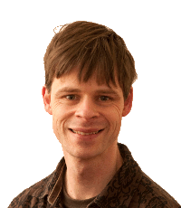

## About me

I was born in the Netherlands and I am now a lecturer in the School of Mathematics at the [University of Leeds](https://www.leeds.ac.uk/).

## Research interests

- Numerical methods for solving differential equations, specifically geometric integration and exponential integrators
- Simulations of plasma physics
- Pattern formation in Faraday waves and complex networks

For more information, have a look at my [research projects](projects.md).
